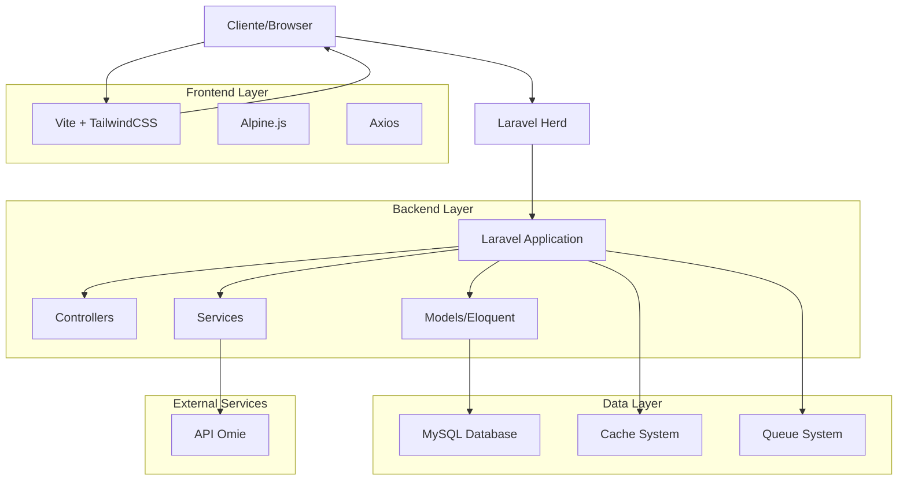
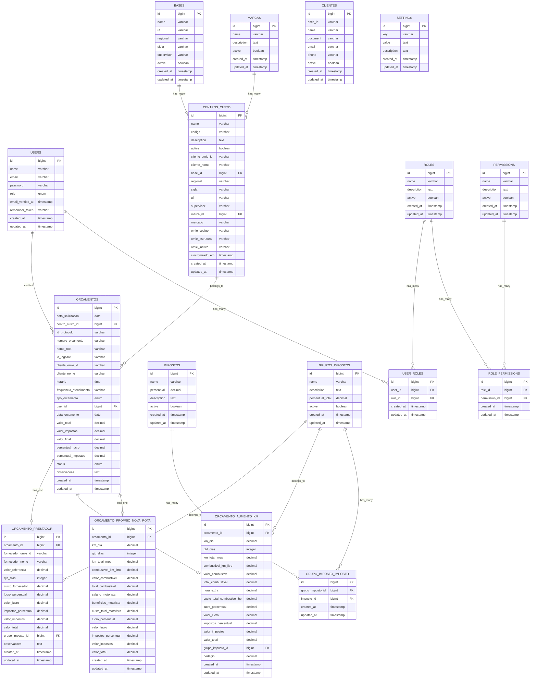
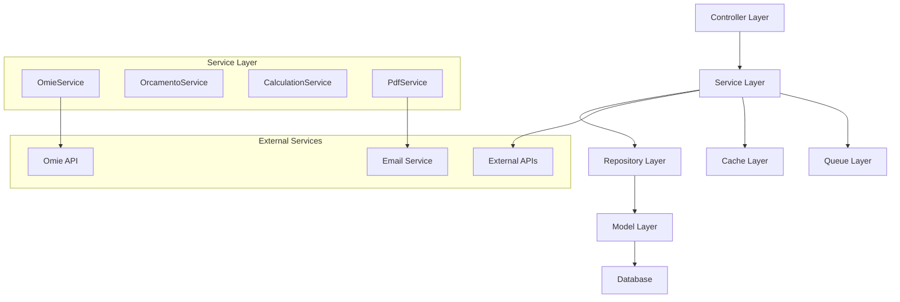

# Arquitetura Técnica do Sistema OBM

## 1. Arquitetura Geral

### Diagrama de Arquitetura


## 2. Tecnologias e Dependências

### Frontend
- **Vite 7.0.4**: Build tool moderno e rápido
- **TailwindCSS 4.0**: Framework CSS utility-first
- **Alpine.js**: Framework JavaScript reativo e leve
- **Axios 1.11.0**: Cliente HTTP para requisições AJAX

### Backend
- **Laravel 12.x**: Framework PHP principal
- **PHP 8.2+**: Linguagem de programação
- **Eloquent ORM**: Mapeamento objeto-relacional
- **DomPDF 3.1**: Geração de documentos PDF

### Banco de Dados
- **MySQL 8.0+**: Sistema de gerenciamento de banco de dados
- **Laravel Migrations**: Controle de versão do banco
- **Database Seeding**: População inicial de dados

### Ambiente de Desenvolvimento
- **Laravel Herd**: Ambiente de desenvolvimento local
- **Composer**: Gerenciador de dependências PHP
- **NPM**: Gerenciador de dependências Node.js

## 3. Estrutura de Rotas

### Rotas de Autenticação
| Rota | Método | Controller | Ação | Descrição |
|------|--------|------------|------|----------|
| `/` | GET | AuthController | showLoginForm | Página de login |
| `/login` | POST | AuthController | login | Processar login |
| `/logout` | POST | AuthController | logout | Processar logout |
| `/check-auth` | GET | AuthController | checkAuth | Verificar autenticação |

### Rotas Administrativas
| Rota | Método | Controller | Descrição |
|------|--------|------------|----------|
| `/admin/dashboard` | GET | DashboardController | Dashboard principal |
| `/admin/users` | GET | DashboardController | Gestão de usuários |
| `/admin/settings` | GET | SettingsController | Configurações do sistema |
| `/admin/reports` | GET | DashboardController | Relatórios |

### Rotas de Recursos (CRUD)
| Recurso | Rota Base | Controller | Funcionalidade |
|---------|-----------|------------|---------------|
| Orçamentos | `/admin/orcamentos` | OrcamentoController | Gestão completa de orçamentos |
| Centros de Custo | `/admin/centros-custo` | CentroCustoController | Gestão de centros de custo |
| Bases | `/admin/bases` | BaseController | Gestão de bases operacionais |
| Marcas | `/admin/marcas` | MarcaController | Gestão de marcas |
| Usuários | `/admin/users` | UserController | Gestão de usuários |
| Impostos | `/admin/impostos` | ImpostoController | Gestão de impostos |
| Grupos de Impostos | `/admin/grupos-impostos` | GrupoImpostoController | Gestão de grupos de impostos |

### Rotas de Integração Omie
| Rota | Método | Controller | Descrição |
|------|--------|------------|----------|
| `/admin/omie/clientes` | GET | OmieController | Listar clientes Omie |
| `/admin/omie/fornecedores` | GET | OmieController | Listar fornecedores Omie |
| `/admin/omie/clientes/{id}` | GET | OmieController | Consultar cliente específico |
| `/admin/omie/fornecedores/{id}` | GET | OmieController | Consultar fornecedor específico |
| `/admin/omie/pessoas` | GET | OmiePessoaController | Listar pessoas Omie |

## 4. Definições de API

### 4.1 APIs Internas

#### Orçamentos
```typescript
// Criar orçamento
POST /admin/orcamentos
Request: {
  data_solicitacao: string,
  centro_custo_id: number,
  nome_rota: string,
  cliente_omie_id?: string,
  tipo_orcamento: 'prestador' | 'aumento_km' | 'proprio_nova_rota',
  // ... outros campos específicos do tipo
}
Response: {
  success: boolean,
  data: Orcamento,
  message: string
}

// Atualizar status
PATCH /admin/orcamentos/{id}/status
Request: {
  status: 'em_andamento' | 'enviado' | 'aprovado' | 'rejeitado' | 'cancelado',
  observacoes?: string
}
Response: {
  success: boolean,
  message: string
}

// Gerar PDF
GET /admin/orcamentos/{id}/pdf
Response: PDF File
```

#### Centros de Custo
```typescript
// Sincronizar com Omie
POST /admin/centros-custo/sincronizar
Request: {}
Response: {
  success: boolean,
  sincronizados: number,
  erros: string[],
  message: string
}

// Obter dados da base
GET /admin/centros-custo/base/{id}/data
Response: {
  regional: string,
  sigla: string,
  uf: string,
  supervisor: string
}
```

#### Configurações
```typescript
// Testar conexão Omie
POST /admin/settings/omie/test
Request: {
  app_key?: string,
  app_secret?: string
}
Response: {
  success: boolean,
  message: string,
  data?: any,
  error?: string
}

// Atualizar configurações Omie
PUT /admin/settings/omie
Request: {
  omie_app_key: string,
  omie_app_secret: string
}
Response: {
  success: boolean,
  message: string
}
```

### 4.2 Integração com API Omie

#### Clientes
```typescript
// Listar clientes
POST https://app.omie.com.br/api/v1/geral/clientes/
Request: {
  call: 'ListarClientes',
  app_key: string,
  app_secret: string,
  param: {
    pagina: number,
    registros_por_pagina: number,
    apenas_importado_api: 'N'
  }
}

// Consultar cliente
POST https://app.omie.com.br/api/v1/geral/clientes/
Request: {
  call: 'ConsultarCliente',
  app_key: string,
  app_secret: string,
  param: {
    codigo_cliente_omie: number
  }
}
```

#### Centros de Custo
```typescript
// Listar centros de custo
POST https://app.omie.com.br/api/v1/geral/centroscusto/
Request: {
  call: 'ListarCentrosCusto',
  app_key: string,
  app_secret: string,
  param: {
    pagina: number,
    registros_por_pagina: number
  }
}
```

## 5. Modelo de Dados

### 5.1 Diagrama Entidade-Relacionamento


### 5.2 DDL (Data Definition Language)

#### Tabela Orçamentos
```sql
CREATE TABLE orcamentos (
    id BIGINT UNSIGNED AUTO_INCREMENT PRIMARY KEY,
    data_solicitacao DATE NOT NULL,
    centro_custo_id BIGINT UNSIGNED NOT NULL,
    id_protocolo VARCHAR(255) NULL,
    numero_orcamento VARCHAR(255) UNIQUE NOT NULL,
    nome_rota VARCHAR(255) NOT NULL,
    id_logcare VARCHAR(255) NULL,
    cliente_omie_id VARCHAR(255) NULL,
    cliente_nome VARCHAR(255) NULL,
    horario TIME NULL,
    frequencia_atendimento VARCHAR(255) NULL,
    tipo_orcamento ENUM('prestador', 'aumento_km', 'proprio_nova_rota') NOT NULL,
    user_id BIGINT UNSIGNED NOT NULL,
    data_orcamento DATE NOT NULL,
    valor_total DECIMAL(10,2) DEFAULT 0,
    valor_impostos DECIMAL(10,2) DEFAULT 0,
    valor_final DECIMAL(10,2) DEFAULT 0,
    percentual_lucro DECIMAL(5,2) NULL,
    percentual_impostos DECIMAL(5,2) NULL,
    status ENUM('em_andamento', 'enviado', 'aprovado', 'rejeitado', 'cancelado') DEFAULT 'em_andamento',
    observacoes TEXT NULL,
    created_at TIMESTAMP NULL,
    updated_at TIMESTAMP NULL,
    
    INDEX idx_cliente_data (cliente_omie_id, data_orcamento),
    INDEX idx_status_data (status, data_orcamento),
    INDEX idx_user_data (user_id, data_orcamento),
    
    FOREIGN KEY (centro_custo_id) REFERENCES centros_custo(id),
    FOREIGN KEY (user_id) REFERENCES users(id)
);
```

#### Tabela Centros de Custo
```sql
CREATE TABLE centros_custo (
    id BIGINT UNSIGNED AUTO_INCREMENT PRIMARY KEY,
    name VARCHAR(255) NOT NULL,
    codigo VARCHAR(20) UNIQUE NOT NULL COMMENT 'Código único do centro de custo',
    description TEXT NULL,
    active BOOLEAN DEFAULT TRUE,
    cliente_omie_id VARCHAR(255) NULL,
    cliente_nome VARCHAR(255) NULL,
    base_id BIGINT UNSIGNED NULL,
    regional VARCHAR(255) NULL,
    sigla VARCHAR(255) NULL,
    uf VARCHAR(2) NULL,
    supervisor VARCHAR(255) NULL,
    marca_id BIGINT UNSIGNED NULL,
    mercado VARCHAR(255) NULL,
    omie_codigo VARCHAR(255) NULL,
    omie_estrutura VARCHAR(255) NULL,
    omie_inativo VARCHAR(1) DEFAULT 'N',
    sincronizado_em TIMESTAMP NULL,
    created_at TIMESTAMP NULL,
    updated_at TIMESTAMP NULL,
    
    INDEX idx_omie_codigo (omie_codigo),
    INDEX idx_active (active),
    INDEX idx_base_marca (base_id, marca_id),
    
    FOREIGN KEY (base_id) REFERENCES bases(id),
    FOREIGN KEY (marca_id) REFERENCES marcas(id)
);
```

#### Tabela Orçamento Prestador
```sql
CREATE TABLE orcamento_prestador (
    id BIGINT UNSIGNED AUTO_INCREMENT PRIMARY KEY,
    orcamento_id BIGINT UNSIGNED NOT NULL,
    fornecedor_omie_id VARCHAR(255) NULL,
    fornecedor_nome VARCHAR(255) NULL,
    valor_referencia DECIMAL(10,2) NOT NULL,
    qtd_dias INTEGER NOT NULL,
    custo_fornecedor DECIMAL(10,2) NOT NULL,
    lucro_percentual DECIMAL(5,2) NOT NULL,
    valor_lucro DECIMAL(10,2) NOT NULL,
    impostos_percentual DECIMAL(5,2) NOT NULL,
    valor_impostos DECIMAL(10,2) NOT NULL,
    valor_total DECIMAL(10,2) NOT NULL,
    grupo_imposto_id BIGINT UNSIGNED NULL,
    observacoes TEXT NULL,
    created_at TIMESTAMP NULL,
    updated_at TIMESTAMP NULL,
    
    FOREIGN KEY (orcamento_id) REFERENCES orcamentos(id) ON DELETE CASCADE,
    FOREIGN KEY (grupo_imposto_id) REFERENCES grupos_impostos(id)
);
```

## 6. Arquitetura de Serviços

### Diagrama de Serviços


### Principais Serviços

#### OmieService
```php
class OmieService
{
    // Configuração e autenticação
    public function __construct()
    public function testConnection(): array
    
    // Clientes
    public function listClients(int $page = 1, int $perPage = 50): array
    public function getClientById(int $omieId): ?array
    public function getClientByDocument(string $document): ?array
    public function searchClientsByTerm(string $term): array
    
    // Fornecedores
    public function listSuppliers(int $page = 1, int $perPage = 50): array
    public function getSupplierById(int $omieId): ?array
    public function searchSuppliersByTerm(string $term): array
    
    // Centros de Custo
    public function listCentrosCusto(int $page = 1, int $perPage = 50): array
    public function syncCentrosCusto(): array
    
    // Utilitários
    private function makeRequest(string $endpoint, string $call, array $params): array
    private function cleanDocument(string $document): string
    private function isValidDocument(string $document): bool
}
```

#### CalculationService
```php
class CalculationService
{
    // Cálculos de orçamento prestador
    public function calculatePrestador(array $data): array
    
    // Cálculos de aumento de KM
    public function calculateAumentoKm(array $data): array
    
    // Cálculos de nova rota própria
    public function calculatePropriaNovaRota(array $data): array
    
    // Cálculos de impostos
    public function calculateImpostos(float $valor, float $percentual): float
    public function calculateGrupoImpostos(float $valor, int $grupoId): array
    
    // Utilitários
    private function roundCurrency(float $value): float
    private function validateCalculationData(array $data): bool
}
```

## 7. Sistema de Cache

### Estratégia de Cache
```php
// Cache de clientes Omie (5 minutos)
Cache::remember("omie_client_{$omieId}", 300, function () use ($omieId) {
    return $this->getClientFromApi($omieId);
});

// Cache de lista de clientes (5 minutos)
Cache::remember("omie_clients_list_{$page}_{$perPage}", 300, function () {
    return $this->getClientsFromApi($page, $perPage);
});

// Cache de configurações (1 hora)
Cache::remember('system_settings', 3600, function () {
    return Setting::all()->pluck('value', 'key');
});
```

### Configuração de Cache
```env
# Database cache (padrão)
CACHE_STORE=database

# Redis cache (produção recomendada)
CACHE_STORE=redis
REDIS_HOST=127.0.0.1
REDIS_PASSWORD=null
REDIS_PORT=6379
```

## 8. Sistema de Filas

### Jobs Disponíveis
```php
// Sincronização com Omie
class SyncOmieDataJob implements ShouldQueue
{
    public function handle(OmieService $omieService)
    {
        // Sincronizar dados com Omie
    }
}

// Geração de PDF
class GeneratePdfJob implements ShouldQueue
{
    public function handle()
    {
        // Gerar PDF do orçamento
    }
}

// Envio de notificações
class SendNotificationJob implements ShouldQueue
{
    public function handle()
    {
        // Enviar notificação por email
    }
}
```

### Configuração de Filas
```env
# Database queue (desenvolvimento)
QUEUE_CONNECTION=database

# Redis queue (produção)
QUEUE_CONNECTION=redis
```

## 9. Segurança

### Middleware de Segurança
```php
// Autenticação administrativa
class AdminAuthMiddleware
{
    public function handle($request, Closure $next)
    {
        if (!auth()->check() || !auth()->user()->isAdmin()) {
            return redirect()->route('login.form');
        }
        return $next($request);
    }
}

// Rate limiting
Route::middleware(['throttle:60,1'])->group(function () {
    // Rotas com limite de requisições
});
```

### Validação de Dados
```php
// Request de criação de orçamento
class CreateOrcamentoRequest extends FormRequest
{
    public function rules()
    {
        return [
            'data_solicitacao' => 'required|date',
            'centro_custo_id' => 'required|exists:centros_custo,id',
            'nome_rota' => 'required|string|max:255',
            'tipo_orcamento' => 'required|in:prestador,aumento_km,proprio_nova_rota',
            // ... outras validações
        ];
    }
}
```

### Proteção CSRF
```php
// Todos os formulários incluem token CSRF
@csrf

// Verificação automática em rotas POST/PUT/PATCH/DELETE
Route::middleware(['web'])->group(function () {
    // Rotas protegidas por CSRF
});
```

## 10. Monitoramento e Logs

### Configuração de Logs
```php
// config/logging.php
'channels' => [
    'stack' => [
        'driver' => 'stack',
        'channels' => ['single'],
    ],
    'single' => [
        'driver' => 'single',
        'path' => storage_path('logs/laravel.log'),
        'level' => env('LOG_LEVEL', 'debug'),
    ],
    'omie' => [
        'driver' => 'single',
        'path' => storage_path('logs/omie.log'),
        'level' => 'info',
    ],
];
```

### Logs Importantes
```php
// Log de integração Omie
Log::channel('omie')->info('Cliente consultado', [
    'omie_id' => $omieId,
    'response_time' => $responseTime
]);

// Log de cálculos
Log::info('Orçamento calculado', [
    'orcamento_id' => $orcamento->id,
    'tipo' => $orcamento->tipo_orcamento,
    'valor_final' => $orcamento->valor_final
]);

// Log de erros
Log::error('Erro na integração Omie', [
    'error' => $exception->getMessage(),
    'trace' => $exception->getTraceAsString()
]);
```

### Métricas de Performance
- Tempo de resposta das APIs
- Taxa de sucesso das integrações
- Uso de cache (hit ratio)
- Tempo de geração de PDFs
- Número de orçamentos por período

---

## Conclusão

Esta arquitetura técnica fornece uma base sólida e escalável para o Sistema OBM, com:

- **Separação clara de responsabilidades** entre camadas
- **Integração robusta** com serviços externos
- **Sistema de cache** eficiente para performance
- **Segurança** em múltiplas camadas
- **Monitoramento** e logs detalhados
- **Escalabilidade** horizontal e vertical

A arquitetura está preparada para crescimento futuro e manutenção contínua, seguindo as melhores práticas do Laravel e padrões de desenvolvimento modernos.