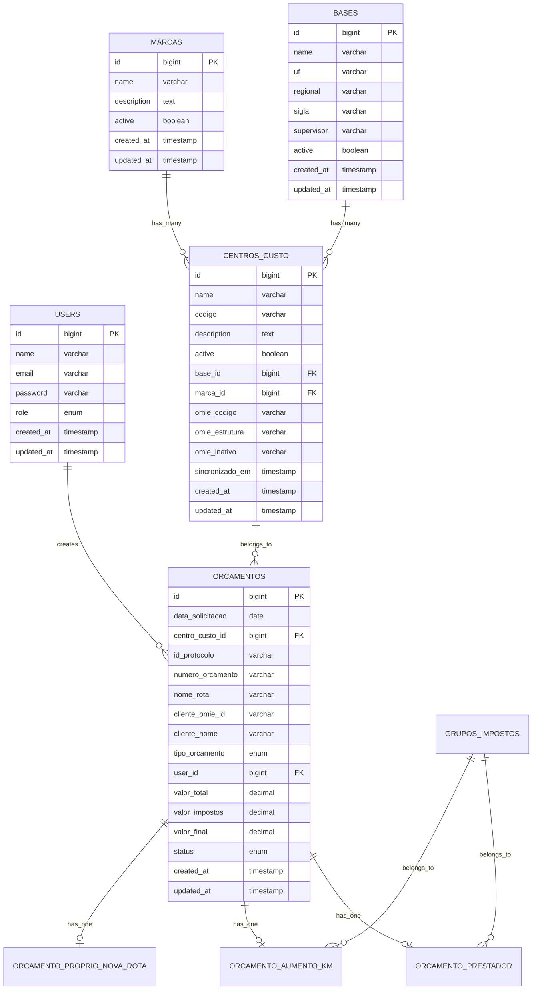
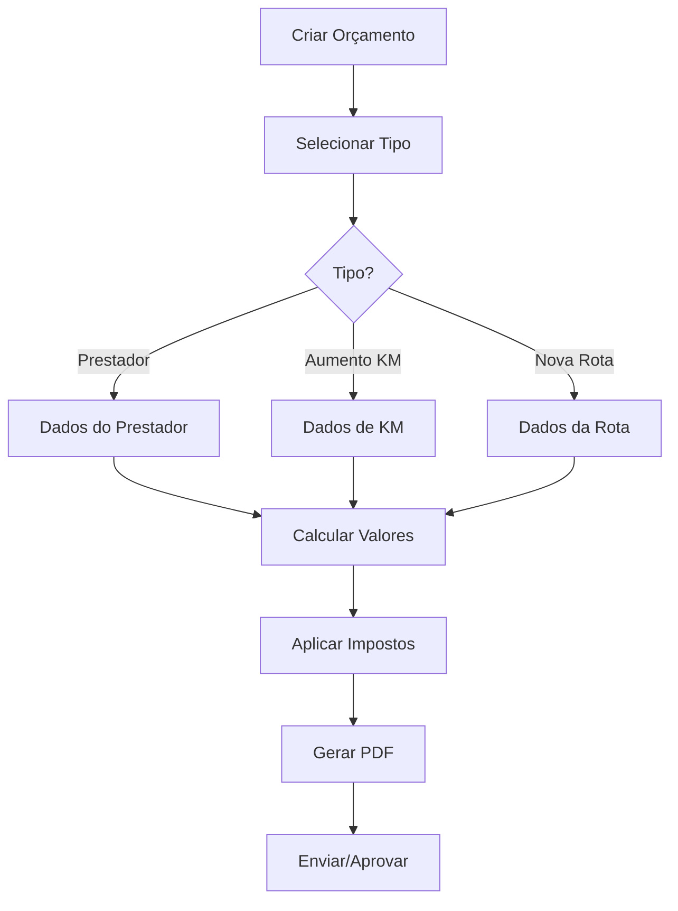
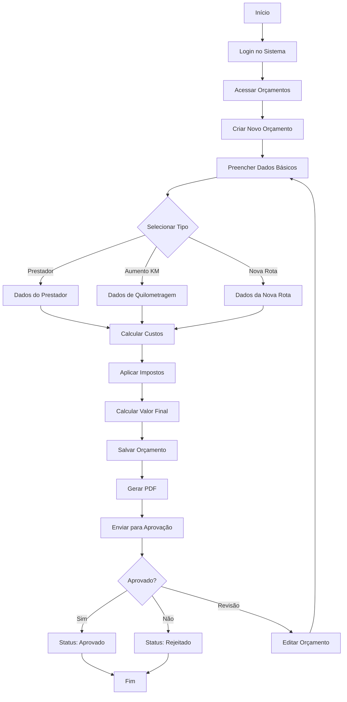

# Documentação Completa do Sistema OBM

## 1. Visão Geral do Sistema

O Sistema OBM (Orçamentos, Bases e Marcas) é uma aplicação web desenvolvida em Laravel para gestão de orçamentos de transporte e logística, com integração completa à API Omie para sincronização de dados de clientes, fornecedores e centros de custo.

### Propósito Principal
- Gestão completa de orçamentos de transporte
- Integração com API Omie para dados empresariais
- Controle de centros de custo, bases e marcas
- Sistema de permissões e usuários
- Cálculos automáticos de impostos e valores

### Características Técnicas
- **Framework**: Laravel 12.x
- **PHP**: 8.2+
- **Frontend**: Vite + TailwindCSS 4.0
- **Banco de Dados**: MySQL
- **Ambiente**: Laravel Herd
- **Autenticação**: Sistema customizado com roles

## 2. Arquitetura e Tecnologias

### Stack Tecnológico
```
Frontend:
├── Vite 7.0.4 (Build tool)
├── TailwindCSS 4.0 (CSS Framework)
├── Alpine.js (JavaScript reativo)
└── Axios (HTTP Client)

Backend:
├── Laravel 12.x (Framework PHP)
├── Eloquent ORM (Database)
├── Laravel Herd (Ambiente local)
└── DomPDF (Geração de PDFs)

Integrações:
├── API Omie (ERP)
├── Cache Laravel (Performance)
└── Queue System (Processamento assíncrono)
```

### Arquitetura MVC
```
app/
├── Http/Controllers/
│   ├── AuthController.php
│   ├── DashboardController.php
│   └── Admin/
│       ├── OrcamentoController.php
│       ├── CentroCustoController.php
│       ├── ClienteController.php
│       ├── OmieController.php
│       └── SettingsController.php
├── Models/
│   ├── User.php
│   ├── Orcamento.php
│   ├── CentroCusto.php
│   ├── Cliente.php
│   ├── Base.php
│   ├── Marca.php
│   └── Imposto.php
├── Services/
│   └── OmieService.php
└── Providers/
    └── AppServiceProvider.php
```

## 3. Modelos de Dados e Relacionamentos

### Diagrama de Relacionamentos


### Principais Modelos

#### 1. Orcamento
**Funcionalidade**: Modelo principal para gestão de orçamentos

**Campos Principais**:
- `data_solicitacao`: Data de solicitação do orçamento
- `centro_custo_id`: FK para centro de custo
- `id_protocolo`: Protocolo único do orçamento
- `numero_orcamento`: Número gerado automaticamente
- `tipo_orcamento`: Enum (prestador, aumento_km, proprio_nova_rota)
- `valor_total`, `valor_impostos`, `valor_final`: Valores calculados
- `status`: Enum (em_andamento, enviado, aprovado, rejeitado, cancelado)

**Relacionamentos**:
- `belongsTo(CentroCusto::class)`
- `belongsTo(User::class)`
- `hasOne(OrcamentoPrestador::class)`
- `hasOne(OrcamentoAumentoKm::class)`
- `hasOne(OrcamentoProprioNovaRota::class)`

**Métodos Especiais**:
- `gerarNumeroOrcamento()`: Gera número único
- `calcularValorFinal()`: Calcula valor final
- `getStatusFormattedAttribute()`: Formata status para exibição

#### 2. CentroCusto
**Funcionalidade**: Gestão de centros de custo com integração Omie

**Campos Principais**:
- `name`, `codigo`, `description`: Dados básicos
- `base_id`, `marca_id`: Relacionamentos
- `omie_codigo`, `omie_estrutura`: Dados da API Omie
- `sincronizado_em`: Controle de sincronização

**Métodos Especiais**:
- `isSincronizado()`: Verifica sincronização com Omie
- `atualizarDadosOmie()`: Atualiza dados da API
- `updateBaseFields()`: Atualiza campos da base

#### 3. User
**Funcionalidade**: Sistema de usuários com roles

**Roles Disponíveis**:
- `admin`: Acesso completo ao sistema
- `manager`: Acesso gerencial (futuro)
- `user`: Acesso básico (futuro)

**Métodos de Autorização**:
- `isAdmin()`, `isManager()`, `isUser()`
- `hasPermission()`, `hasRole()`
- `getDashboardRoute()`: Rota baseada no role

## 4. Funcionalidades Principais

### 4.1 Gestão de Orçamentos

#### Tipos de Orçamento
1. **Prestador**: Orçamentos para prestadores terceirizados
2. **Aumento KM**: Orçamentos para aumento de quilometragem
3. **Próprio Nova Rota**: Orçamentos para novas rotas próprias

#### Fluxo de Trabalho


#### Status do Orçamento
- **Em Andamento**: Orçamento sendo elaborado
- **Enviado**: Orçamento enviado para aprovação
- **Aprovado**: Orçamento aprovado
- **Rejeitado**: Orçamento rejeitado
- **Cancelado**: Orçamento cancelado

### 4.2 Integração com API Omie

#### Funcionalidades Disponíveis
- **Clientes**: Sincronização automática de dados
- **Fornecedores**: Consulta em tempo real
- **Centros de Custo**: Sincronização bidirecional
- **Cache**: Sistema de cache para performance

#### Configuração
```php
// .env
OMIE_APP_KEY=sua_chave_aqui
OMIE_APP_SECRET=seu_secret_aqui
OMIE_API_URL=https://app.omie.com.br/api/v1/
```

#### Métodos Principais do OmieService
- `testConnection()`: Testa conectividade
- `listClients()`: Lista clientes com paginação
- `getClientById()`: Busca cliente por ID
- `searchClientsByTerm()`: Busca por termo
- `syncCentrosCusto()`: Sincroniza centros de custo

### 4.3 Sistema de Impostos

#### Estrutura
- **Impostos**: Impostos individuais (ICMS, PIS, COFINS, etc.)
- **Grupos de Impostos**: Agrupamentos de impostos
- **Cálculo Automático**: Aplicação automática nos orçamentos

#### Funcionalidades
- Cadastro de impostos com percentuais
- Agrupamento de impostos por tipo de operação
- Cálculo automático nos orçamentos
- Relatórios de impostos aplicados

### 4.4 Gestão de Bases e Marcas

#### Bases
- Cadastro de bases operacionais
- Controle por UF e regional
- Supervisores responsáveis
- Integração com centros de custo

#### Marcas
- Cadastro de marcas/clientes
- Associação com centros de custo
- Controle de ativação/desativação

## 5. API Endpoints e Serviços

### Rotas Principais

#### Autenticação
```php
POST /login              // Login do usuário
POST /logout             // Logout do usuário
GET  /check-auth         // Verificar autenticação
```

#### Dashboard
```php
GET /admin/dashboard     // Dashboard principal
GET /admin/users         // Gestão de usuários
GET /admin/settings      // Configurações
GET /admin/reports       // Relatórios
```

#### Orçamentos
```php
GET    /admin/orcamentos           // Listar orçamentos
GET    /admin/orcamentos/create    // Formulário de criação
POST   /admin/orcamentos           // Criar orçamento
GET    /admin/orcamentos/{id}      // Visualizar orçamento
GET    /admin/orcamentos/{id}/edit // Editar orçamento
PUT    /admin/orcamentos/{id}      // Atualizar orçamento
DELETE /admin/orcamentos/{id}      // Excluir orçamento
PATCH  /admin/orcamentos/{id}/status // Atualizar status
GET    /admin/orcamentos/{id}/pdf   // Gerar PDF
```

#### Centros de Custo
```php
GET  /admin/centros-custo                    // Listar centros
POST /admin/centros-custo                    // Criar centro
GET  /admin/centros-custo/{id}               // Visualizar centro
PUT  /admin/centros-custo/{id}               // Atualizar centro
POST /admin/centros-custo/sincronizar        // Sincronizar com Omie
GET  /admin/centros-custo/base/{id}/data     // Dados da base
```

#### Integração Omie
```php
GET /admin/omie/clientes              // Listar clientes Omie
GET /admin/omie/fornecedores          // Listar fornecedores Omie
GET /admin/omie/clientes/{id}         // Consultar cliente específico
GET /admin/omie/fornecedores/{id}     // Consultar fornecedor específico
```

### Middleware de Segurança
- `admin.auth`: Verificação de autenticação administrativa
- Proteção CSRF em formulários
- Validação de dados de entrada
- Rate limiting em APIs

## 6. Configuração e Instalação

### Requisitos do Sistema
- PHP 8.2 ou superior
- MySQL 8.0 ou superior
- Node.js 18+ (para assets)
- Laravel Herd (recomendado)
- Composer

### Instalação

1. **Clone o repositório**
```bash
git clone [repositorio]
cd obmsistem
```

2. **Instale dependências PHP**
```bash
composer install
```

3. **Instale dependências Node.js**
```bash
npm install
```

4. **Configure ambiente**
```bash
cp .env.example .env
php artisan key:generate
```

5. **Configure banco de dados**
```env
DB_CONNECTION=mysql
DB_HOST=127.0.0.1
DB_PORT=3306
DB_DATABASE=obmsistem
DB_USERNAME=root
DB_PASSWORD=
```

6. **Execute migrações**
```bash
php artisan migrate
php artisan db:seed
```

7. **Configure API Omie**
```env
OMIE_APP_KEY=sua_chave_aqui
OMIE_APP_SECRET=seu_secret_aqui
OMIE_API_URL=https://app.omie.com.br/api/v1/
```

8. **Inicie desenvolvimento**
```bash
npm run dev  # Terminal 1 - Assets
# Laravel Herd cuida do servidor PHP automaticamente
```

### Configurações Importantes

#### Cache
```env
CACHE_STORE=database
SESSION_DRIVER=database
QUEUE_CONNECTION=database
```

#### Logs
```env
LOG_CHANNEL=stack
LOG_STACK=single
LOG_LEVEL=debug
```

## 7. Estrutura de Permissões e Usuários

### Sistema de Roles

#### Admin
- Acesso completo ao sistema
- Gestão de usuários
- Configurações do sistema
- Todos os módulos disponíveis

#### Manager (Futuro)
- Gestão de orçamentos
- Visualização de relatórios
- Acesso limitado às configurações

#### User (Futuro)
- Criação de orçamentos
- Visualização próprios orçamentos
- Acesso básico ao sistema

### Controle de Acesso
```php
// Middleware de autenticação
Route::middleware(['admin.auth'])->group(function () {
    // Rotas protegidas
});

// Verificação de permissões
if ($user->hasPermission('create_orcamento')) {
    // Permitir ação
}
```

### Usuário Padrão
- **Email**: admin@admin.com
- **Senha**: password
- **Role**: admin

## 8. Integração com API Omie

### Configuração da API

#### Obtenção das Chaves
1. Acesse o painel Omie
2. Vá em Configurações > Integrações
3. Gere App Key e App Secret
4. Configure no sistema

#### Teste de Conectividade
```php
// Via interface web
/admin/settings -> Testar Conexão Omie

// Via código
$omieService = new OmieService();
$result = $omieService->testConnection();
```

### Funcionalidades Disponíveis

#### Clientes
- Listagem com paginação
- Busca por ID, documento ou nome
- Cache automático (5 minutos)
- Sincronização sob demanda

#### Fornecedores
- Consulta em tempo real
- Busca por critérios múltiplos
- Cache de resultados

#### Centros de Custo
- Sincronização bidirecional
- Mapeamento de campos
- Controle de status (ativo/inativo)
- Histórico de sincronização

### Tratamento de Erros
- Logs detalhados de falhas
- Fallback para dados locais
- Retry automático em falhas temporárias
- Notificações de problemas de conectividade

## 9. Fluxo de Trabalho dos Orçamentos

### Processo Completo



### Estados do Orçamento

1. **Em Andamento**
   - Orçamento sendo elaborado
   - Permite edição completa
   - Cálculos automáticos ativos

2. **Enviado**
   - Orçamento finalizado e enviado
   - Edição restrita
   - Aguardando aprovação

3. **Aprovado**
   - Orçamento aprovado
   - Somente leitura
   - Pode gerar documentos finais

4. **Rejeitado**
   - Orçamento rejeitado
   - Pode ser editado e reenviado
   - Histórico de rejeição mantido

5. **Cancelado**
   - Orçamento cancelado
   - Somente leitura
   - Não pode ser reativado

### Cálculos Automáticos

#### Orçamento Prestador
```php
$custo_fornecedor = $valor_referencia * $qtd_dias;
$valor_lucro = $custo_fornecedor * ($lucro_percentual / 100);
$valor_impostos = ($custo_fornecedor + $valor_lucro) * ($impostos_percentual / 100);
$valor_total = $custo_fornecedor + $valor_lucro + $valor_impostos;
```

#### Orçamento Aumento KM
```php
$km_total_mes = $km_dia * $qtd_dias;
$total_combustivel = $km_total_mes / $combustivel_km_litro;
$custo_total_combustivel_he = $valor_combustivel + $hora_extra;
$valor_lucro = $custo_total_combustivel_he * ($lucro_percentual / 100);
$valor_total = $custo_total_combustivel_he + $valor_lucro + $valor_impostos;
```

## 10. Guia de Desenvolvimento e Manutenção

### Estrutura de Desenvolvimento

#### Padrões de Código
- **PSR-12**: Padrão de codificação PHP
- **Eloquent ORM**: Para interações com banco
- **Service Pattern**: Para lógicas complexas
- **Repository Pattern**: Para consultas específicas

#### Convenções de Nomenclatura
```php
// Controllers
class OrcamentoController extends Controller

// Models
class CentroCusto extends Model

// Services
class OmieService

// Migrations
2025_08_22_081248_create_orcamentos_table.php

// Routes
Route::resource('admin/orcamentos', OrcamentoController::class);
```

### Testes

#### Estrutura de Testes
```
tests/
├── Feature/
│   ├── OrcamentoTest.php
│   ├── AuthTest.php
│   └── OmieIntegrationTest.php
└── Unit/
    ├── OmieServiceTest.php
    ├── OrcamentoCalculationTest.php
    └── UserPermissionTest.php
```

#### Executar Testes
```bash
# Todos os testes
php artisan test

# Testes específicos
php artisan test --filter OrcamentoTest

# Com coverage
php artisan test --coverage
```

### Deployment

#### Ambiente de Produção
```bash
# Otimizações
php artisan config:cache
php artisan route:cache
php artisan view:cache
composer install --optimize-autoloader --no-dev

# Assets
npm run build
```

#### Variáveis de Ambiente Produção
```env
APP_ENV=production
APP_DEBUG=false
APP_URL=https://seu-dominio.com

# Cache Redis (recomendado)
CACHE_STORE=redis
SESSION_DRIVER=redis
QUEUE_CONNECTION=redis
```

### Monitoramento

#### Logs Importantes
- `storage/logs/laravel.log`: Logs gerais
- Logs de integração Omie
- Logs de cálculos de orçamentos
- Logs de autenticação

#### Métricas de Performance
- Tempo de resposta das APIs
- Cache hit ratio
- Tempo de sincronização Omie
- Uso de memória

### Backup e Segurança

#### Backup Automático
```bash
# Banco de dados
mysqldump -u user -p obmsistem > backup_$(date +%Y%m%d).sql

# Arquivos
tar -czf files_backup_$(date +%Y%m%d).tar.gz storage/app/
```

#### Segurança
- Validação de entrada em todos os formulários
- Proteção CSRF ativa
- Sanitização de dados
- Logs de auditoria
- Backup regular de dados

### Troubleshooting

#### Problemas Comuns

1. **Erro de Conexão Omie**
   - Verificar chaves de API
   - Testar conectividade
   - Verificar logs de erro

2. **Problemas de Cache**
   - Limpar cache: `php artisan cache:clear`
   - Verificar configuração de cache

3. **Erros de Migração**
   - Verificar status: `php artisan migrate:status`
   - Rollback se necessário: `php artisan migrate:rollback`

4. **Problemas de Permissão**
   - Verificar roles do usuário
   - Verificar middleware de autenticação

#### Comandos Úteis
```bash
# Limpar todos os caches
php artisan optimize:clear

# Recriar banco (desenvolvimento)
php artisan migrate:fresh --seed

# Verificar configuração
php artisan config:show

# Verificar rotas
php artisan route:list

# Verificar jobs na fila
php artisan queue:work
```

---

## Conclusão

O Sistema OBM é uma solução completa para gestão de orçamentos de transporte, oferecendo:

- **Integração robusta** com API Omie
- **Cálculos automáticos** de impostos e valores
- **Interface intuitiva** com TailwindCSS
- **Arquitetura escalável** em Laravel
- **Sistema de permissões** flexível
- **Relatórios e PDFs** automatizados

O sistema está preparado para crescimento futuro com estrutura modular e padrões de desenvolvimento bem definidos.

### Próximos Passos Sugeridos
1. Implementação de relatórios avançados
2. Sistema de notificações
3. API REST para integrações externas
4. Dashboard com métricas em tempo real
5. Sistema de aprovação workflow
6. Integração com outros ERPs

### Suporte e Manutenção
Para suporte técnico e manutenção, consulte:
- Logs do sistema em `storage/logs/`
- Documentação da API Omie
- Documentação do Laravel
- Este documento de referência

---

**Versão da Documentação**: 1.0  
**Data de Criação**: Janeiro 2025  
**Última Atualização**: Janeiro 2025  
**Autor**: Sistema OBM Team